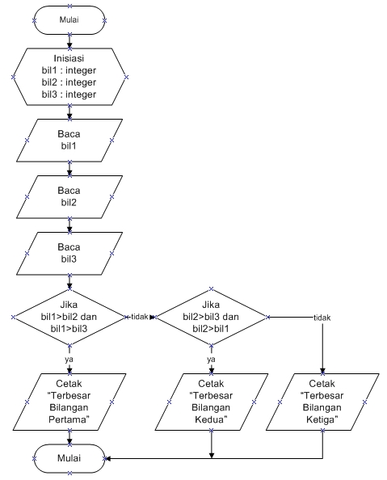

# Pertemuan ke-7

## Tugas Praktikum Modul 2

### Latihan Praktikum Modul 2

Buat program sederhana dengan input tiga buah bilangan, dari ketiga bilangan
tersebut tampilkan bilangan terbesarnya. Gunakan statement if.

```python
a = int(input("Masukan bilangan ke-1 :"))
b = int(input("Masukan bilangan ke-2 :"))
c = int(input("Masukan bilangan ke-3 :"))

max = a

if b > max:
   max = b

if c > max:
   max = c

print()
print("Nilai terbesar :", max)
``` 
### Hasil Programnya

.png)

### Flowchart




## Tugas Struktur Kondisi

### Latihan 1

Buat program sederhada dengan input 2 buah bilangan, kemudian tentukan bilangan terbesar dari kedua bilangan tersebut menggunakan statement if.

```python
bil1 = int (input("Masukan bilangan : "))
bil2 = int (input("Masukan bilangan : "))

#Nilai terbesar

if (bil1 > bil2):
   print("Bilangan terbesar :",bil1)

#Nilai terkecil

if (bil1 < bil2):
   print("Bilangan terbesar :",bil2)
```

### Hasil Programnya
.png)

### Latihan 2

Buat program untuk mengurutkan data berdasarkan input sejumlah
data (minimal 3 variable input atau lebih), kemudian tampilkan
hasilnya secara berurutan mulai dari data terkecil.

```python
bil1 = int(input("Bilangan ke-1: "))
bil2 = int(input("Bilangan ke-2: "))
bil3 = int(input("Bilangan ke-3: "))

#Buat variable data
data = [bil1, bil2, bil3]

#Menampilkan data
print("Data sebelum di urutkan :", data)
list.sort(data)
print("Data setelah di urutkan :", data)
```

### Hasil Programnya
.png)


## Tugas Perulangan

### Latihan 1

Buat program dengan perulangan bertingkat (Nested) for

```python
baris = 10
kolom = baris

for bar in range(baris):
    for col in range(kolom):
        tab = bar+col
        print("{0:>5}".format(tab), end='')
    print()
```

### Hasil Programnya

.png)

### Latihan 2

Tampilkan n bilangan acak yang lebih kecil dari 0.5.
nilai n diisi pada saat runtime
anda  bisa menggunakan kombinasi while dan for untuk menyelesaikannya

```python
import random
print("===========================================")
print("= Bilangan acak yang lebih kecil dari 0,5 =")
print("===========================================")

jum = int( input("Masukan nilai: "))
i = 0
while i in range(jum):
    i += 1
    angkarandom = random.uniform(0,0.5)
    print("Bilangan ke :", i, " : ", angkarandom)
```

### Hasil Programnya
.png)